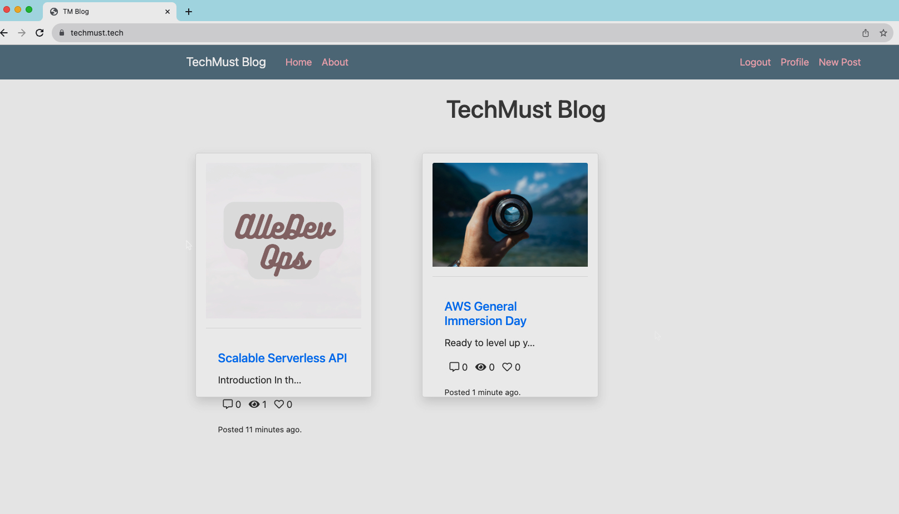

# Developing a Secure and Scalable Django Blog on AWS

## Project Overview

This project focuses on deploying a Django-powered blog application on AWS, leveraging various services like EC2, RDS, S3, DynamoDB, CloudFront, and Route 53. The goal is to create a resilient and secure web platform where users can upload multimedia content to their blog pages, with files stored in S3 buckets and details recorded in a DynamoDB table.

## Technologies Utilized

- AWS IAM
- VPC
- EC2
- RDS
- Amazon S3
- AWS Certificate Manager (SSL/TLS)
- CloudFront
- Route 53
- CloudFormation
- Amazon API Gateway
- AWS Lambda
- DynamoDB
- Python 3.8
- SQL

## Project Structure

To effectively implement the **TechMust Blog** Application on AWS infrastructure with the desired architecture, we'll organize our project into several core components as outlined below:

### 1. Amazon Web Services (AWS)

- **Amazon Virtual Private Cloud (VPC)**: A tailored VPC configuration ensures the isolation of our application.
- **Amazon Elastic Compute Cloud (EC2) Instances**: These instances will host our Django web application, utilizing Launch Templates for streamlined setup.
- **Amazon Relational Database Service (RDS)**: An RDS instance will manage user registration data using MySQL.
- **Amazon Simple Storage Service (S3)**: Serving as our storage solution, S3 will house user-uploaded media, with two buckets designated for regular use and failover.
- **AWS Certificate Manager**: SSL certificates for secure connections will be created using this service, for both Application Load Balancer (ALB) and Amazon CloudFront.
- **Amazon CloudFront**: Configured as a cache server, CloudFront will optimize content delivery from ALB.
- **Amazon Route 53**: Responsible for secure and reliable traffic routing, ensuring website publication and failover management.
- **Amazon DynamoDB**: This NoSQL database will store S3 Bucket content metadata for efficient data retrieval.
- **AWS Lambda**: A Python 3.8 Lambda function will facilitate the writing of S3 objects to the DynamoDB table.
- **AWS Identity and Access Management (IAM)**: IAM roles and policies will be defined to grant necessary permissions to EC2 instances, Lambda function, and other resources.

### 2. Configuration Components

- **Security Groups**: Configured for ALB, EC2 instances, and RDS, ensuring secure traffic flow.
- **NAT Instance or Bastion Host**: Depending on preference, the necessary components for secure access to private resources will be set up.

### 3. Project GitHub Repository

A GitHub project repository will be established to store application code, infrastructure configurations, and related files.

### 4. Developer Guidelines

Developer notes provided by the team will guide the setup of Django environment on EC2 instances, application deployment, and RDS configuration.

### 5. Requirements.txt

This file will list required Python packages and dependencies for the Django application.

## Monitoring and Alerting

To oversee application and infrastructure health, AWS CloudWatch will collect and display performance metrics, logs, and events. Analysis of these metrics and logs enables the identification of potential issues and performance bottlenecks.

## Security and Compliance

### IAM Roles and Policies

Fine-grained access control is ensured through IAM roles and policies, adhering to the principle of least privilege. This minimizes security vulnerabilities and unauthorized access.

### Data Encryption

- **At Rest**: Amazon RDS encryption secures sensitive data, adding an extra layer of protection for persistent storage.

- **In Transit**: All data exchanged between components is encrypted using secure communication protocols like HTTPS, safeguarding against eavesdropping or man-in-the-middle attacks.

### Network Security

- **VPC Isolation**: Operating within a dedicated VPC ensures logical segmentation and prevents unauthorized access.

- **Security Groups and NACLs**: Used to control inbound and outbound traffic, enforcing security policies at the network level.

### Compliance Considerations

- **GDPR Compliance**: Adherence to GDPR guidelines ensures lawful and transparent processing of personal data.

- **Data Residency**: Compliance with relevant regulations and geographical restrictions for data storage and processing is ensured.

- **Audit Logging**: Comprehensive audit logs track system activities, supporting compliance audits and providing visibility into security incidents.

## Outcome

Refer to the [outcomes](./outcomes/) folder to view all images and videos validating project outcomes.

## Overcoming Challenges

1. **DynamoDB Data Sync Issue with Lambda:**
   - **Issue**: Noticed a lack of corresponding object information in DynamoDB despite functioning S3 object creation.
   - **Resolution**: Investigated DynamoDB and Lambda functions, discovered successful Lambda triggers but identified the need to create a dedicated security group for Lambda and grant necessary permissions on the DynamoDB security group due to running Lambda in a private VPC. Implemented adjustments to resolve the issue.

These challenges underscore the importance of thorough debugging, script updates, and understanding AWS service interactions, contributing to the robust functionality of the deployed application.

## Room for Growth

There are exciting possibilities for further refinement and expansion. Here are some suggestions:

### Enhanced Security for DynamoDB:

- Refine IAM roles and policies for DynamoDB security, embracing the principle of least privilege. Periodic reviews and updates can align permissions with evolving business needs. Additionally, consider enabling AWS Key Management Service (KMS) encryption for DynamoDB to add an extra layer of protection to sensitive data.

### Secure S3 Bucket Configuration:

- Evaluate and tighten access control policies for the S3 bucket, utilizing IAM roles and bucket policies to restrict access. Enabling versioning for the S3 bucket could maintain a historical record of changes, offering added protection against accidental deletions or unauthorized modifications.

### Automated Deployment with AWS CodePipeline:

- Integrate AWS CodePipeline for continuous integration and deployment (CI/CD) pipeline. This can streamline development, automate testing, and enhance deployment practices, ensuring rigorous testing before deploying code changes to different environments.

Embracing these enhancements could contribute to a more resilient and efficient Django-based blog application on the AWS platform.

### Conclusion

In conclusion, this AWS-deployed Django blog project excels in security, scalability, and compliance. Overcoming challenges underscores its robustness, contributing to a resilient and efficient application.

## References

- AWS Documentation:
  - [AWS Lambda Networking](https://docs.aws.amazon.com/lambda/latest/dg/foundation-networking.html)
  - [EC2 Auto Scaling Health Checks](https://docs.aws.amazon.com/autoscaling/ec2/userguide/ts-as-healthchecks.html)
- GitHub: [My AWS Capstone Project](https://github.com/devenes/my-aws-capstone-project)

## License

This project is licensed under the MIT License. Feel free to use, modify, and distribute it for both commercial and non-commercial purposes, subject to the following conditions:

- This software is provided "as is," without warranty of any kind, express or implied, including but not limited to the warranties of merchantability, fitness for a particular purpose, and non-infringement.
- In no event shall the authors or copyright holders be liable for any claim, damages, or other liability, whether in an action of contract, tort, or otherwise, arising from, out of, or in connection with the software or the use or other dealings in the software.
  --------------Rolex-----------------
